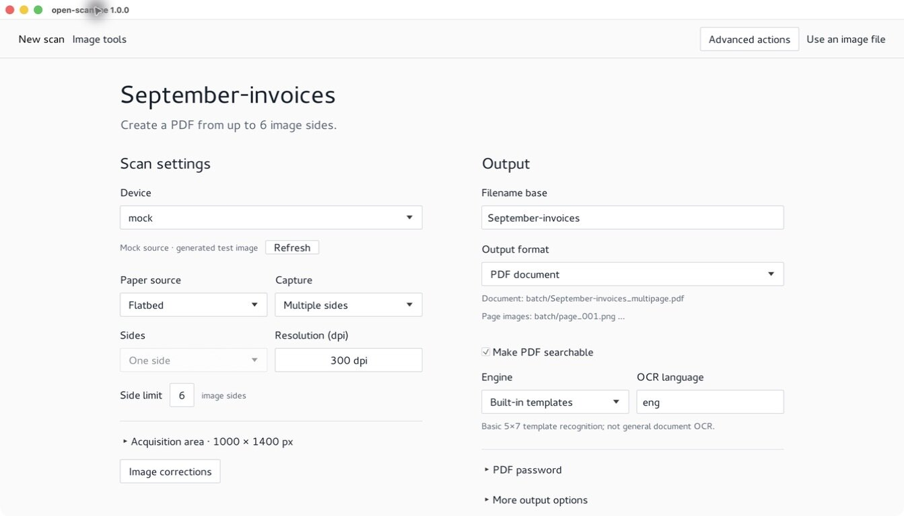
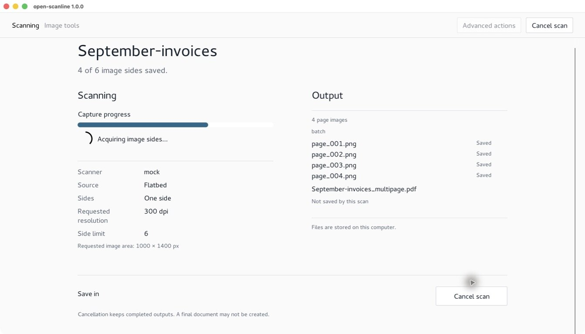
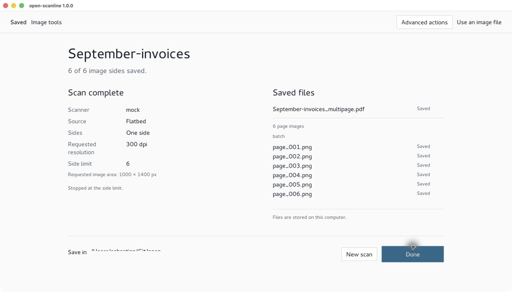
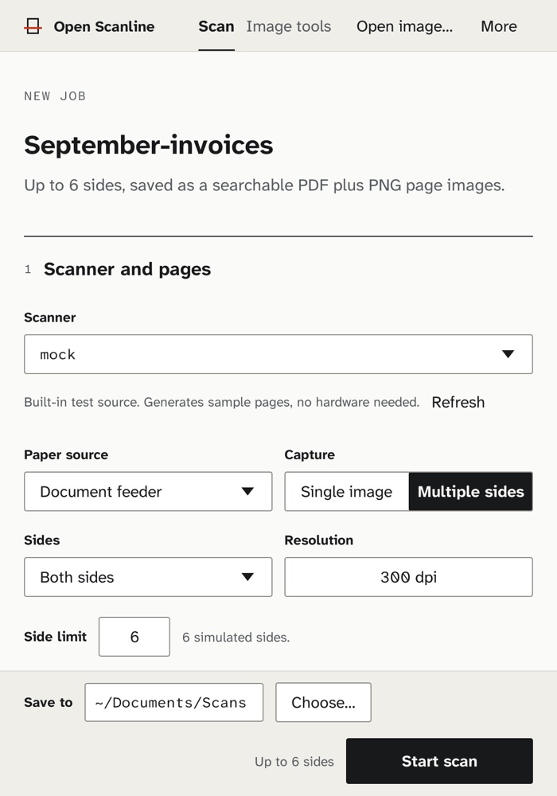
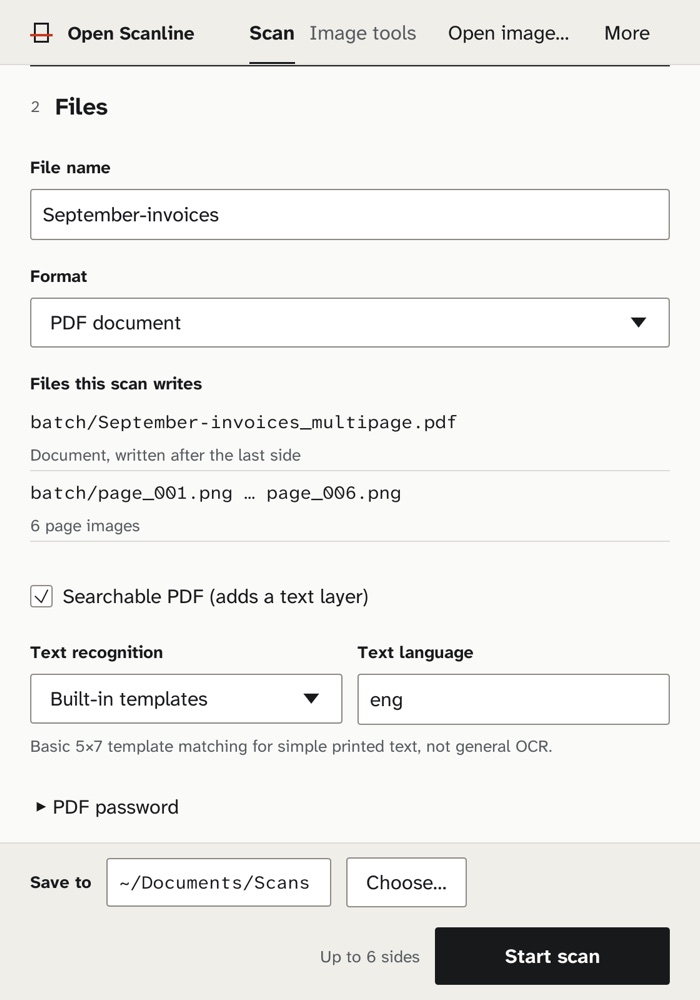
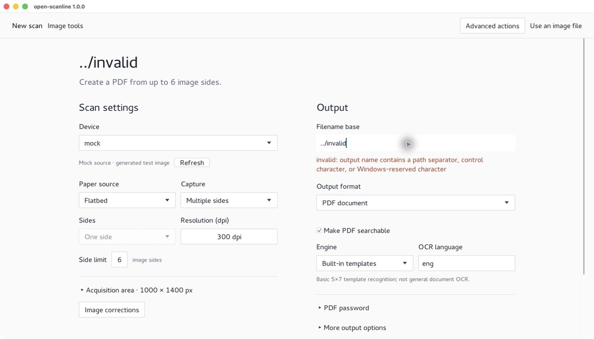

# Open Scanline

Local-first scanning, image processing, and OCR in Rust.

Open Scanline acquires pages from flatbed and document scanners, cleans them up,
and writes out images, searchable PDFs, and multipage TIFF or PDF — all on your
own machine. It ships as a command-line tool with an optional desktop GUI, plus a
public Rust library you can embed.

No cloud service, no accounts, no telemetry.

[](https://github.com/sebastianspicker/open-scanline/actions/workflows/ci.yml)


[](LICENSE)

## Screenshots

The desktop workspace keeps acquisition and output settings together, then
switches to progress and to the files it actually published.

<p align="center">
  
</p>
<p align="center"><em>Prepare — choose the source, sides, resolution, and destination before you start.</em></p>

| Scanning | Saved |
|:---:|:---:|
|  |  |
| Progress lists each page as it is published, and distinguishes saved pages from the document still to come. | The result lists what was written to disk and why capture stopped. |

Narrow windows stack the same controls in reading order, and bad output names are
rejected inline before a scan starts:

<p align="center">
  
  
</p>

<p align="center">
  
</p>

Screenshots are from the macOS build using the built-in mock source. No scanner
hardware or personal documents are shown, and local paths are removed.

**[Browse the full screenshot tour →](https://sebastianspicker.github.io/open-scanline/)**

## Quick start

Run these commands from the repository root. The core-only profile omits the GUI,
OCRS, and ONNX:

```bash
cargo run --no-default-features -- --version
cargo run --no-default-features -- devices
cargo run --no-default-features -- scan --device mock --out scan.png \
  --width 320 --height 240
cargo run --no-default-features -- process --in scan.png \
  --out processed.png --invert
```

Run the desktop interface with the default feature profile:

```bash
cargo run -- gui
```

`devices` reports the sources visible on the current machine. A reported backend
does not guarantee that a particular scanner is installed, connected, or
reachable.

## Supported sources

Open Scanline always includes mock and file sources, so you can build and try
the workflow without any hardware. Real scanners depend on the operating
system, installed software, device permissions, and network.

| Source | Linux | macOS | Windows | Requirement |
| --- | --- | --- | --- | --- |
| Mock and file | Yes | Yes | Yes | None beyond readable input for file sources |
| SANE | Yes | When SANE is installed | When SANE is installed | A working `scanimage` and a configured device |
| WIA | No | No | Yes | Windows PowerShell, WIA, and a usable scanner |
| eSCL | Yes | Yes | Yes | A reachable AirScan/eSCL scanner over HTTP or HTTPS |
| TWAIN host integration | Host-dependent | Host-dependent | Host-dependent | A separate host or bridge; this is not an acquisition backend |

See [backend and tool requirements](docs/backends.md) for discovery controls,
platform qualifications, and optional Tesseract and JPEG XL support.

## What you can do

- **Acquire.** Single pages through mock, file, WIA, SANE, and eSCL sources, plus
  one-session ADF batches through WIA, SANE, and eSCL when the device advertises
  the requested feeder controls.
- **Maintain.** Capability-aware scanner maintenance: simulated controls for mock
  and WIA simulation, and device-advertised SANE calibration or focus where
  available.
- **Process.** Crop, rotate, flip, adjust color and levels, deskew, white-balance,
  sharpen, clean up documents, and apply film-oriented controls.
- **Export.** PNG, JPEG, TIFF, WebP, BMP, GIF, PDF, multipage TIFF, and multipage
  PDF, including searchable and password-protected PDFs.
- **Read text.** Built-in offline template OCR, optional local OCRS model packs
  for printed Latin English documents, and optional Tesseract integration.
- **Run models.** Local inference for user-supplied ONNX image models through an
  explicitly selected, version-matched Open Scanline worker.
- **Configure.** JSON settings in the platform-specific `open-scanline`
  configuration directory.

Detailed commands and examples are in [the usage guide](docs/usage.md).

## Documentation

| Document | Contents |
| --- | --- |
| [Usage](docs/usage.md) | Commands, configuration, OCR, PDF export, and the desktop and plugin modes |
| [Backends](docs/backends.md) | Platform and scanner requirements, discovery, and optional tools |
| [Architecture](docs/architecture.md) | Layers, data flow, and compatibility boundaries |
| [Release notes](docs/release-notes.md) | Public API changes planned for the next release |

## Repository structure

Open Scanline is one Cargo package with an executable and a library target.

| Path | Purpose |
| --- | --- |
| `src/main.rs` | `open-scanline` executable entry point |
| `src/lib.rs` and top-level `src/*.rs` | Public library surface (re-exports only) |
| `src/domain/` | Scan, image, export, and settings values and rules; pure processing |
| `src/infrastructure/` | Scanner, media, configuration, runtime, ONNX, and distribution adapters |
| `src/workflows/` | Capture, batch, processing, publication, and maintenance use cases |
| `src/inbound/` | CLI, GUI, diagnostics, plugin, and host entry adapters |
| `assets/` | Fonts, UI translations, and license texts embedded in the binary |

Dependencies point from `inbound` to `workflows` to `infrastructure` to `domain`.
Read [the architecture guide](docs/architecture.md) before moving code or
changing an exported path.

## Build and verify

The repository pins Rust 1.91.0, including `cargo`, Clippy, and rustfmt, through
`rust-toolchain.toml`. Install [Rust with rustup](https://rustup.rs/) first, then
build from the repository root:

```bash
cargo build --release --locked
```

The release executable is `target/release/open-scanline` on Linux and macOS, or
`target/release/open-scanline.exe` on Windows. Use `--no-default-features` for a
core-only build, or `--no-default-features --features ocrs,onnx` for a full
headless build.

## Portable archive

The `package --binary <path> --out <zip>` command creates a portable archive,
records the packaging host operating system and architecture in `PORTABLE.txt`,
and verifies the archive structure, executable metadata, size, and SHA-256 hash
without launching the supplied program. Build and package on the intended target
operating system:

```bash
cargo build --release --no-default-features --locked
cargo run --release --no-default-features --locked -- package \
  --binary target/release/open-scanline \
  --out open-scanline-portable.zip
```

On Windows, use `target/release/open-scanline.exe` for `--binary`. Extract and
run the archive from a directory of your choice.

Linux or macOS:

```bash
unzip open-scanline-portable.zip
./open-scanline/run.sh --version
```

Windows PowerShell:

```powershell
Expand-Archive .\open-scanline-portable.zip -DestinationPath .
.\open-scanline\run.bat --version
```

The archive contains this README and the license notices, but not the source
repository's `docs/` directory.

## Boundaries

A few behaviors are deliberately narrower than they might first appear:

- **Sides, not sheets.** `batch --pages` counts logical image sides. Duplex needs
  the ADF source and an even page count, so `--pages 2` means the front and back
  of one sheet. A single-image `scan --duplex` is rejected rather than silently
  dropping the back.
- **Mock and file batches are simulations.** They repeat a page deterministically
  to exercise the shared batch pipeline. They do not claim a feeder, source
  negotiation, or physical duplex behavior.
- **TWAIN is host integration only.** Open Scanline can run its headless plugin
  mode for a separate TWAIN-capable host or bridge, but it ships no native TWAIN
  Data Source and does not acquire through TWAIN.
- **Hardware varies.** The adapters negotiate the capabilities they can observe,
  but no compatibility table can guarantee a particular scanner, feeder, driver,
  firmware, or vendor extension. Validate production hardware on its target
  operating system before relying on it.
- **No proprietary components.** Open Scanline does not include proprietary
  scanner drivers, firmware, or third-party activation and licensing systems.

## Releases and security

Public API changes planned for the next release are listed in the
[release notes](docs/release-notes.md). For vulnerabilities, follow
[SECURITY.md](SECURITY.md) rather than opening a public issue.

## License

Project code is [MIT licensed](LICENSE). The embedded searchable-PDF font is
covered by the notices and license terms in
[THIRD_PARTY_NOTICES.md](THIRD_PARTY_NOTICES.md).
