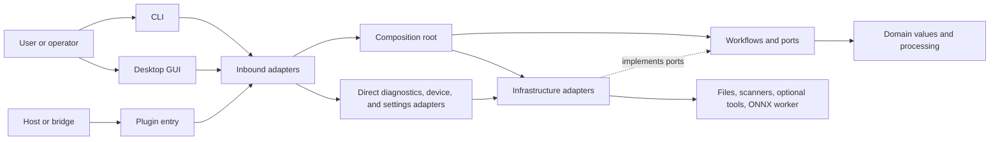

# Architecture

Open Scanline is a native Rust application. A single library powers the CLI, the
optional desktop GUI, and the headless plugin and host entry points. Older
top-level modules remain as compatibility facades; the real implementation lives
in the layers below.

## System context

Open Scanline is a layered monolith: one executable and one library target in a
single Cargo package. It stores settings and output artifacts locally, calls
installed scanner or media tools when you ask it to, and talks to eSCL scanners on
the local network. There is no server and no database.



## Layers

`src/domain/` holds the typed scan request, image buffer and geometry, processing
preferences, calibration, and the pure processing operations. It may depend on its
own modules and shared error values, never on adapters, entry points, or
compatibility modules.

`src/workflows/` implements the capture, batch, processing, publication, and
settings use cases. Its narrow `AcquisitionPort` and `MediaPort` describe only the
capabilities capture and publication need. A workflow states the operation and
its cancellation, validation, ordering, and publication rules; it does not choose
a scanner, codec, configuration format, or UI.

`src/infrastructure/` supplies those concrete capabilities: mock/file/SANE/WIA
and eSCL acquisition, JSON settings, media codecs/PDF/OCR/ICC, immutable OCRS
model packs, explicit ONNX worker isolation, process supervision, atomic
publication, and portable archives.

`src/inbound/` adapts external requests into workflows. It owns CLI parsing and
output, the optional GUI, diagnostics, plugin mode, and host integration.
`src/composition.rs` is the native composition root, wiring `NativeAcquisition`
and `NativeMedia` for the workflow entry points. The device catalog and
maintenance operations, and JSON settings persistence, are direct inbound adapter
concerns rather than workflow ports.

The dependency direction is:

```text
inbound -> composition -> workflows <- infrastructure
                         |
                         v
                       domain
```

Infrastructure implements workflow ports. Domain has no outward dependency, and
workflows never import infrastructure or inbound modules.

## State and data flow

An inbound adapter builds typed input and invokes a workflow with the port it
needs. Capture opens one device session, produces one image or a bounded stream of
logical sides, applies domain processing, and publishes through the media port.
Batch keeps page paths in order and assembles optional documents after the pages
are published, instead of holding every decoded page in memory. The inbound edge
loads and saves JSON settings through the settings adapter; configuration and
language are application-instance state, while translation catalogs are immutable
data.


Scanner artifacts, OCR input, configuration, profiles, and package outputs are
validated before same-directory atomic publication. Cancellation flows through the
operation and into command-backed adapters.

## External contracts

`DeviceSession` is the acquisition-session contract. Its maintenance capability
query has a safe unsupported default, so an adapter must advertise calibration or
centre/point focus before inbound code can dispatch it. Mock and file backends are
deterministic, hardware-free sources; physical backends provide the same contract.
Batch limits count logical image sides, from 1 through 1,000, and a single-image
duplex request is rejected rather than losing a side.

SANE needs `scanimage`; WIA needs Windows PowerShell/COM and compatible hardware;
eSCL uses bounded HTTP(S) discovery or an explicit endpoint. An unlisted eSCL
endpoint requires the strict `--allow-unlisted-escl` opt-in. TWAIN support starts a
separate host integration — it is not a native TWAIN Data Source or an acquisition
backend.

SANE maintenance parses a separate device option inventory and builds only fixed
allowlisted commands. Real WIA, eSCL, and file maintenance stay unsupported; mock
and test-only WIA maintenance are marked simulated. The GUI caches that snapshot
on device selection and inventory refresh, and disables any operation the selected
device did not advertise.

Template OCR is built in. OCRS uses an explicitly installed local RTen model pack,
while Tesseract OCR and JPEG XL depend on explicitly selected optional executables.
User ONNX models run locally in a supervised, explicitly selected, version-matched
Open Scanline worker with resource limits — not in a filesystem or syscall
sandbox. Deprecated library helpers without an explicit worker fail closed and
never search for a sibling executable.

A passing build or test suite cannot prove a physical scanner, driver, feeder,
firmware, desktop session, optional model pack, or optional tool on a target
machine.

There is no deployment service and no database migration boundary. Distribution is
an explicitly invoked portable-ZIP step around an already built binary, and
`Cargo.toml` disables crate publication. Build and package on the intended target
host, because the packager records — but does not infer — the executable's target
operating system and architecture.

## Compatibility and placement

The top-level `core`, `device`, `scan`, `batch`, `process`, `export`, `imaging`,
`config`, `cli`, `gui`, and backend-named modules preserve established library
paths. Keep those facades thin; `tests/public_api_contract.rs` protects the names
and signatures consumed outside the new layer tree. The domain, workflow,
infrastructure, inbound, and composition modules are private, so adapter
implementations do not leak into the public API.

Put new pure value and processing logic in domain, use-case coordination and port
traits in workflows, concrete I/O and platform behavior in infrastructure, and
CLI/GUI/plugin translation in inbound. Add production wiring only in composition.
`scripts/check_architecture.sh` enforces these boundaries and rejects path-module
wiring.

## Image and export resource ownership

The public pipeline borrows its input and clones it once at entry. Workflows move
their owned decoded image into the private pipeline, and disabled stages return
that allocation. Scanner-profile JSON stays a public interchange format, while
export preparation builds a typed matrix/gamma transform once. PDF and TIFF keep
their public borrowed transform callbacks and use private owned loading paths for
production exports.

An export owns its OCR job. OCRS checks the active pointer and manifest and hashes
each model on every page, then reuses the engine only while the verified model
content is unchanged. A corrupt or invalid replacement returns an error; the job
never falls back to the previously selected engine. Chunked reads and the
boundaries around construction and inference check cancellation, but an active
OCRS inference call cannot be interrupted internally.

When a batch requests several aggregate outputs, a private publication session
shares one page loader. It caches decoded published pages as packed pixels in a
private temporary directory, capped at 512 MiB including cache headers. Each reuse
rechecks the source content. Cache failures and exhausted capacity fall back to
ordinary decoding, and source and encoder errors stay visible. TIFF/PDF/sheet
publication stays sequential, so a later failure preserves earlier published
outputs. RAII cleanup removes the private cache on normal return, error,
cancellation, and unwinding. PDF still retains compressed streams until its atomic
publication, and decoded source pages are processed one at a time.

GUI startup, refresh, and selected-device capability probes share one background
worker with a coalesced pending request and generation checks. Rendering reads
cached preview statistics and textures. An image change invalidates both caches,
and maintenance stays disabled until current capabilities arrive. Closing the
window cancels discovery and defers exit until its worker has finished.

ONNX fills its final target-sized tensor from packed input pixels, without a
source-sized float expansion. Worker identity verification, the private execution
image, process isolation, and resource limits form the inference boundary. The
`gui`, `ocrs`, and `onnx` Cargo features select implementations, while
compatibility facades and CLI parsing stay present in every profile.

The architecture guard tokenizes Rust before checking imports. It expands grouped
and multiline imports, including nested groups and aliases, and ignores comments
and string literals. Its tests cover the same layer and facade rules enforced on
ordinary paths.
