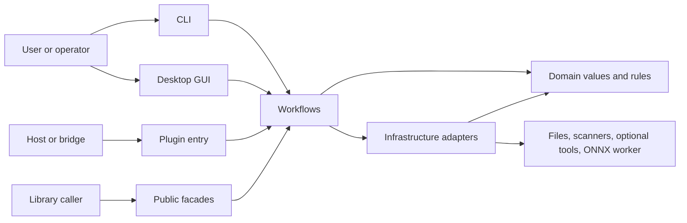

# Architecture

Open Scanline is a native Rust application. A single library powers the CLI, the
optional desktop GUI, and the headless plugin and host entry points. The public
library paths are thin re-export modules over private layers.

## System context

Open Scanline is a layered monolith: one executable and one library target in a
single Cargo package. It stores settings and output artifacts locally, calls
installed scanner or media tools when you ask it to, and talks to eSCL scanners on
the local network. There is no server and no database.



## Layers

Dependencies point one way. A layer may use any layer below it, never one above:

```text
inbound  ->  workflows  ->  infrastructure  ->  domain
```

`src/domain/` holds values and rules with no I/O: the scan request and page-limit
rules, image buffers and geometry, processing preferences and the pure processing
operations, export options and OCR engine names, settings validation, and the
manufacturer catalog.

`src/infrastructure/` holds every concrete adapter. `acquisition` owns the
`DeviceSession` contract and its mock, file, SANE, WIA, and eSCL
implementations; `command_backend` is the shared machinery for the two
command-driven backends. `media` owns codecs, PDF, TIFF, OCR, ICC profiles, and
the aggregate page cache. `config` owns `AppConfig` and its JSON persistence.
`runtime` owns process supervision, command capture, atomic publication, and
temporary files; it depends on no other adapter. `onnx` owns the isolated
inference worker, and `distribution` the portable archive.

`src/workflows/` holds each multi-step use case and calls infrastructure
directly: `capture::single` and `capture::batch` (including batch output
naming), `process`, `publication` (validation, OCR, profile correction and
atomic output), `maintenance` (calibration, focus, exposure, and IT8 scanner
profiling), and `settings` (resolving configured defaults). Each use case has one
canonical entry that takes its arguments plus an options struct.
`workflows::compat` holds the documented public permutations of the scan, batch,
and process entry points and nothing else.

`src/inbound/` translates external requests: CLI parsing and output, the optional
GUI, diagnostics, plugin mode, host integration, and UI translations (loaded from
`assets/i18n/`). Inbound calls workflows for anything that opens a device
session or publishes output through more than one adapter. It may call
infrastructure directly only for single-step capabilities listed in
`scripts/check_architecture.py` (device inventory, config persistence, platform
information, packaging, single-file convert, OCR and ONNX command entries).

`src/error.rs` (`ScanError`) and `src/operation.rs` (`CancellationToken`) are
shared by every layer.

There are no traits whose only purpose is to separate layers. `DeviceSession` is a
trait because five backends implement it and library callers may implement it
too; everything else is a concrete type or function.

## State and data flow

An inbound adapter builds typed input and calls the canonical workflow entry.
Capture opens one device session, produces one image or a bounded stream of
logical sides, applies domain processing, and publishes through media. Batch
keeps page paths in order and assembles optional documents after the pages are
published, instead of holding every decoded page in memory. The inbound edge
loads and saves JSON settings through `infrastructure::config`; configuration and
language are application-instance state, while translation catalogs are immutable
data.


Scanner artifacts, OCR input, configuration, profiles, and package outputs are
validated before same-directory atomic publication. Cancellation flows through the
operation and into command-backed adapters.

## External contracts

`DeviceSession` is the acquisition-session contract. Its maintenance capability
query has a safe unsupported default, so an adapter must advertise calibration or
centre/point focus before inbound code can dispatch it. Mock and file backends are
deterministic, hardware-free sources; physical backends provide the same contract.
Batch limits count logical image sides, from 1 through 1,000, and a single-image
duplex request is rejected rather than losing a side.

SANE needs `scanimage`; WIA needs Windows PowerShell/COM and compatible hardware;
eSCL uses bounded HTTP(S) discovery or an explicit endpoint. An unlisted eSCL
endpoint requires the strict `--allow-unlisted-escl` opt-in. TWAIN support starts a
separate host integration — it is not a native TWAIN Data Source or an acquisition
backend.

SANE maintenance parses a separate device option inventory and builds only fixed
allowlisted commands. Real WIA, eSCL, and file maintenance stay unsupported; mock
and test-only WIA maintenance are marked simulated. The GUI caches that snapshot
on device selection and inventory refresh, and disables any operation the selected
device did not advertise.

Template OCR is built in. OCRS uses an explicitly installed local RTen model pack,
while Tesseract OCR and JPEG XL depend on explicitly selected optional executables.
User ONNX models run locally in a supervised, explicitly selected, version-matched
Open Scanline worker with resource limits — not in a filesystem or syscall
sandbox. Deprecated library helpers without an explicit worker fail closed and
never search for a sibling executable.

The CLI (subcommands, output, exit codes 0/1/2/130), the plugin status JSON, the
configuration file, scanner-profile JSON, the OCRS model-pack manifest, and the
portable archive layout are external contracts; `tests/cli_workflows.rs`,
`tests/cli_contract.rs`, `tests/config_contract.rs`, and the CI portable smoke
step protect them.

A passing build or test suite cannot prove a physical scanner, driver, feeder,
firmware, desktop session, optional model pack, or optional tool on a target
machine.

There is no deployment service and no database migration boundary. Distribution is
an explicitly invoked portable-ZIP step around an already built binary, and
`Cargo.toml` disables crate publication. Build and package on the intended target
host, because the packager records — but does not infer — the executable's target
operating system and architecture.

## Public library surface and placement

The top-level modules in `src/lib.rs` (`core`, `device`, `scan`, `batch`,
`process`, `export`, `imaging`, `pipeline`, `config`, `cli`, `gui`, the
backend-named modules, and the rest) are the documented public library. Each is a
`pub use` list only; `tests/public_api_contract.rs` protects their names and
signatures, and `docs/release-notes.md` records changes. The layer modules are
private, so implementation types never leak.

Put new pure values and rules in domain, concrete I/O and platform behavior in
infrastructure, multi-step use cases in workflows, and CLI/GUI/plugin translation
in inbound. Expose something publicly only by adding it to a facade.

`scripts/check_architecture.sh` enforces the dependency direction, the inbound
infrastructure allowlist, re-export-only facades, private layer modules, and the
ban on `#[path]` module wiring. It tokenizes Rust before checking imports, so
grouped and multiline imports, nested groups, and aliases are expanded and
comments and string literals are ignored.

## Image and export resource ownership

The public pipeline borrows its input and clones it once at entry. Workflows move
their owned decoded image into the private pipeline, and disabled stages return
that allocation. Scanner-profile JSON stays a public interchange format, while
export preparation builds a typed matrix/gamma transform once. PDF and TIFF keep
their public borrowed transform callbacks and use private owned loading paths for
production exports.

An export owns its OCR job. OCRS checks the active pointer and manifest and hashes
each model on every page, then reuses the engine only while the verified model
content is unchanged. A corrupt or invalid replacement returns an error; the job
never falls back to the previously selected engine. Chunked reads and the
boundaries around construction and inference check cancellation, but an active
OCRS inference call cannot be interrupted internally.

When a batch requests several aggregate outputs, a private publication session
shares one page loader. It caches decoded published pages as packed pixels in a
private temporary directory, capped at 512 MiB including cache headers. Each reuse
rechecks the source content. Cache failures and exhausted capacity fall back to
ordinary decoding, and source and encoder errors stay visible. TIFF/PDF/sheet
publication stays sequential, so a later failure preserves earlier published
outputs. RAII cleanup removes the private cache on normal return, error,
cancellation, and unwinding. PDF still retains compressed streams until its atomic
publication, and decoded source pages are processed one at a time.

GUI startup, refresh, and selected-device capability probes share one background
worker with a coalesced pending request and generation checks. Rendering reads
cached preview statistics and textures. An image change invalidates both caches,
and maintenance stays disabled until current capabilities arrive. Closing the
window cancels discovery and defers exit until its worker has finished.

ONNX fills its final target-sized tensor from packed input pixels, without a
source-sized float expansion. Worker identity verification, the private execution
image, process isolation, and resource limits form the inference boundary. The
`gui`, `ocrs`, and `onnx` Cargo features select implementations, while
public facades and CLI parsing stay present in every profile.
